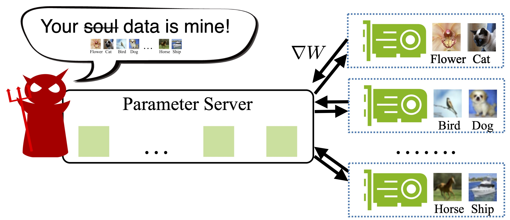
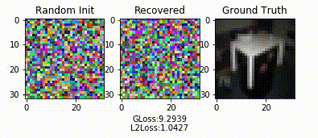
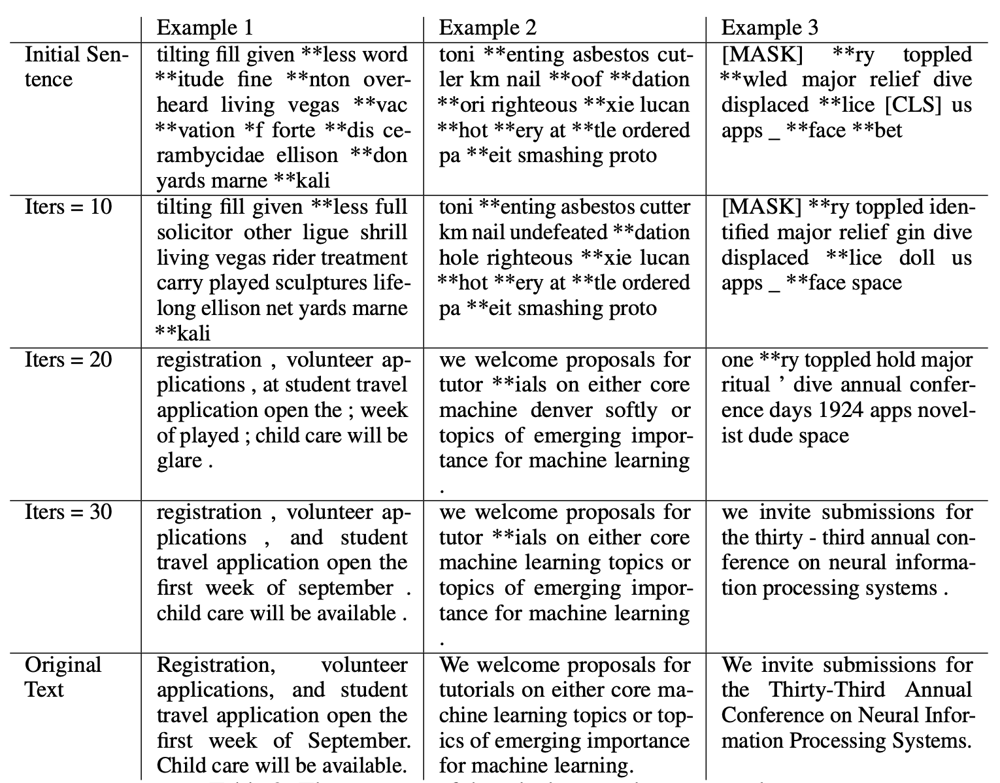

# Deep Leakage From Gradients [[arXiv]](https://arxiv.org/abs/1906.08935) [[Webside]](https://dlg.mit.edu) 


```
@inproceedings{zhu19deep,
  title={Deep Leakage from Gradients},
  author={Zhu, Ligeng and Liu, Zhijian and Han, Song},
  booktitle={Advances in Neural Information Processing Systems},
  year={2019}
}
```

Gradients exchaging is popular used in modern multi-node learning systems. People used to believe numerical gradients are safe to share. But we show that it is actually possible to obtain the training data from shared gradients and the leakage is pixel-wise accurate for images and token-wise matching for texts.

<p align="center">
    
</p>

<p align="center">
    
</p>

## Overview

The core algorithm is to *match the gradients* between *dummy data* and *real data*.

<p align="center">
    
</p>

It can be implemented in **less than 20 lines** with PyTorch!


```python
def deep_leakage_from_gradients(model, origin_grad): 
  dummy_data = torch.randn(origin_data.size())
  dummy_label =  torch.randn(dummy_label.size())
  optimizer = torch.optim.LBFGS([dummy_data, dummy_label] )

  for iters in range(300):
    def closure():
      optimizer.zero_grad()
      dummy_pred = model(dummy_data) 
      dummy_loss = criterion(dummy_pred, F.softmax(dummy_label, dim=-1)) 
      dummy_grad = grad(dummy_loss, model.parameters(), create_graph=True)

      grad_diff = sum(((dummy_grad - origin_grad) ** 2).sum() \
        for dummy_g, origin_g in zip(dummy_grad, origin_grad))
      
      grad_diff.backward()
      return grad_diff
    
    optimizer.step(closure)
    
  return  dummy_data, dummy_label
```


# Prerequisites

To run the code, following libraies are required

* Python >= 3.6
* PyTorch >= 1.0
* torchvision >= 0.4

# Code

<!-- * If you do not have GPU mahcines, We provide [Google Colab](https://colab.research.google.com/gist/Lyken17/91b81526a8245a028d4f85ccc9191884/deep-leakage-from-gradients.ipynb) to quickly reproduce our results. 
* If you have GPU servers and would like to run your locally, `python main.py` provides the same functionality. -->

 <p align="center">Note: We provide 
    <a href="https://colab.research.google.com/gist/Lyken17/91b81526a8245a028d4f85ccc9191884/deep-leakage-from-gradients.ipynb" target="_parent"></a>
    for quick reproduction.
</p>

```
# Single image on CIFAR
python main.py --index 25

# Deep Leakage on your own Image
python main.py --image yours.jpg
```
  
# Deep Leakage on Batched Images

<p align="center">
    
</p>

# Deep Leakage on Language Model

<p align="center">
    
</p>


# License

This repository is released under the MIT license. See [LICENSE](LICENSE) for additional details.
